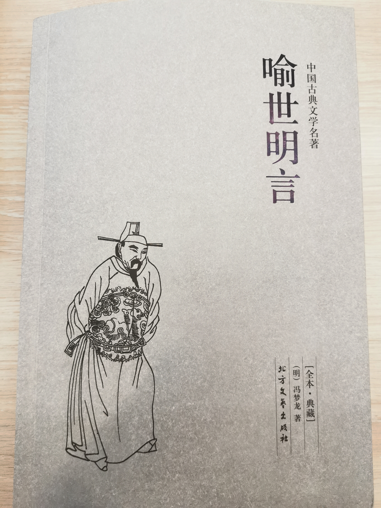

# 冯梦龙《喻世明言》读书笔记

冯梦龙的三言和凌濛初的二拍，是明代小说话本的经典作品。  
这本《喻世明言》便是三言其一。  
其余网上能搜到标答的介绍性内容，就不做赘述了。  

## 目录
- [冯梦龙《喻世明言》读书笔记](#冯梦龙喻世明言读书笔记)
  - [目录](#目录)
  - [更新日志](#更新日志)
  - [开篇的闲扯](#开篇的闲扯)
  - [叙](#叙)
  - [第一卷 蒋兴哥重会珍珠衫](#第一卷-蒋兴哥重会珍珠衫)
  - [第二卷 陈御史巧勘金钗钿](#第二卷-陈御史巧勘金钗钿)
  - [第三卷 新桥市韩五卖春情](#第三卷-新桥市韩五卖春情)
  - [第四卷 闲云庵阮三偿冤债](#第四卷-闲云庵阮三偿冤债)
  - [第五卷 穷马周遭际卖䭔媪](#第五卷-穷马周遭际卖䭔媪)
  - [第六卷 葛令公生遣弄珠儿](#第六卷-葛令公生遣弄珠儿)
  - [第七卷 羊角哀舍命全交](#第七卷-羊角哀舍命全交)
  - [第八卷 吴保安弃家赎友](#第八卷-吴保安弃家赎友)
  - [第九卷 裴晋公义还原配](#第九卷-裴晋公义还原配)
  - [第十卷 滕大尹鬼断家私](#第十卷-滕大尹鬼断家私)

## 更新日志
|修改人|修改日期|修改内容|
|-|-|-|
|朱里|2021.3.7  |阅读第一至第四卷。|
|朱里|2021.3.13 |阅读第五至第十卷。|

## 开篇的闲扯
全书四十篇，每篇一个小故事。  
怪力乱神也好，封建礼教也好，不求什么，就感受一下明传奇的风格吧。  

文学从来不是，也不应该是个束之高阁的东西。  
因为文化和人一样，总要保持活力才能生生不息。  
冯梦龙作为通俗小说的代表人物，把文学发展成了普罗大众喜闻乐见的形式。  
除文学以外，我们到今天的很多传统戏剧、曲艺形式里，都有他的小说作品传承其中。  

咱们这位冯老爷，一生屡次科举不第，会试都进不去。  
56岁好不容易拔了贡，60岁当上县太爷。  
踏踏实实干了4年，就告老还乡了。  
所幸一生总归是平安的。  

而他所生的年代，已是明朝末期。  
本书成于1621年，那年孙传庭刚弃官回家，大明离灭亡还有23年。
他作为一个生逢乱世的读书人，选择以神怪讽当世也不难理解了。  

接下来是对正文的摘抄和笔记。  

## 叙

序言的作者“绿天馆主人”姓名不详。  

## 第一卷 蒋兴哥重会珍珠衫

开篇第一卷，就是蒋兴哥和王三巧的故事。  
现在曲艺和相声里依然保留了这个选段。  

明清小说的开篇和结尾喜欢以诗词作为引子和总结。
以说书唱戏为为例，开篇是**定场诗**，收尾便是**扣子**。  
词牌选取上，《西江月》尤为常见。  
杨升庵的经典词话《二十一史弹词》中就有大量以《西江月》填词的。  

“仕至千钟非贵，年过七十常稀。”  

评剧唱词“襄阳府枣阳县名叫罗德”。  
蒋家为了生意便利，借重罗家名声，就把亲儿子假借罗姓了。  

“有缘千里能相会，无缘对面不相逢。”  
要不怎么说“摇一摇”呢...  

接下来的情节当然和历朝历代PUA如出一辙，“嬉戏眼前谋，万恶淫为首”。  
这薛婆的形象，倒是一个非常老练的社会人。  
凡事讲究利益、套路和来往，也就是做人懂得“留扣子”。  
不过，当今社会换了个叫法——“全流程闭环”。  

“画虎画皮难画骨，知人知面不知心。”  
一个称职的小人，是很难分辨的。  
因为你看出来了，他也就失职了。  

蒋兴哥做生意走了，陈大郎折腾一圈又做生意走了。  
帝吧的名言特别应景——“毅种循环”。  

这故事的结局倒也离奇，毕竟是无巧不生书。  
定场诗里的“只为淫人妇，难保妻儿否”用在陈商身上就很贴切了。  
而其他人的各自结局，当然有劝人向善的意思在里头。  

## 第二卷 陈御史巧勘金钗钿

拾金不昧，最朴素的传统美德了。  
单口相声有经典选段《黄金梦》，君子小人就在一念之间。  

“尽说宦家门户倒，谁怜清吏子孙贫。”  
这也是循环之一。  

看了两页没个头绪，原来是出冒名顶替的大戏。  
这背调啊，太重要了。  

按故事来说，这个铺垫还挺长的。  
而整件事呢，却是被一个别有用心的采花贼给弄成了瞒天过海。  
给一个明察秋毫的大人看，其实每一环都有迹可查。  

这每一话结尾都得来个“劝人方”式的大团圆。  
看来明传奇也得给广电总局审一审啊，贺岁档有点儿意思。  

## 第三卷 新桥市韩五卖春情

合着这一话就是披着神鬼外衣的青春期教育。  
苦口婆心呐。  

## 第四卷 闲云庵阮三偿冤债

文青和千金的故事，倒也无甚出奇。  

## 第五卷 穷马周遭际卖䭔媪

生僻字要了亲命了。  
“䭔”音堆，蒸饼子。  
“媪”音袄，老妇人。  

这篇好像就是大明之赘婿系列？  
爽文石锤了。  

## 第六卷 葛令公生遣弄珠儿

倒是无甚稀奇。  

## 第七卷 羊角哀舍命全交

羊左之交在历史上是一段佳话，不过后面的二鬼战荆轲就太鬼畜了。  
就算抛开封建迷信，这个剧情的槽点也太多了，以至于成了小区业主打架的情景喜剧。  

## 第八卷 吴保安弃家赎友

义气，世交。  

## 第九卷 裴晋公义还原配

相面看命，当然封建迷信不足道。  
所谓相，相的是气质，看的是性格。  
然后呢？性格决定命运。  

结局日常大团圆。  

## 第十卷 滕大尹鬼断家私

类似张广泰张广聚的故事。  
不过县官巧断案是个包袱，装神弄鬼糊弄人。  
